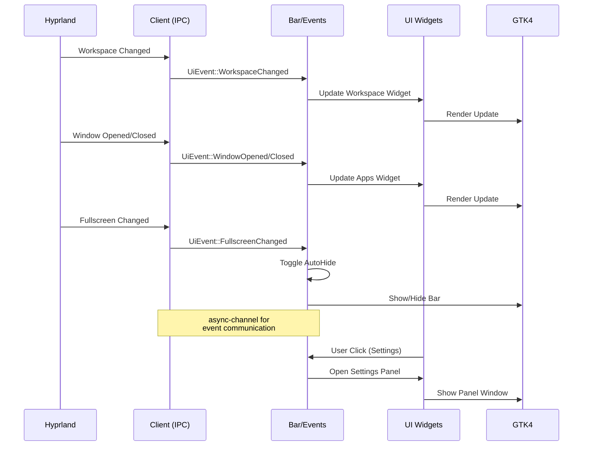
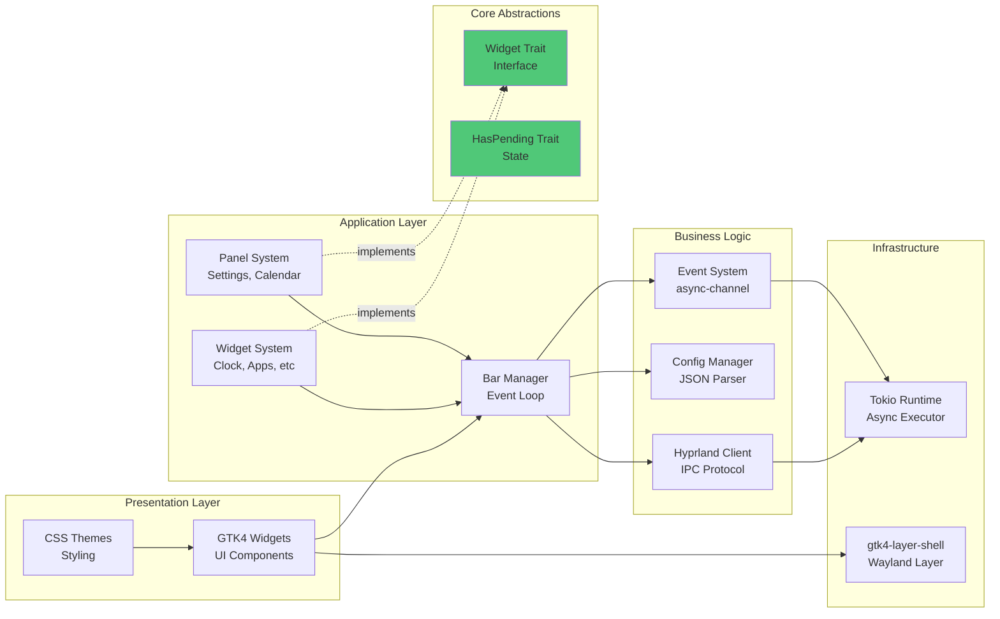
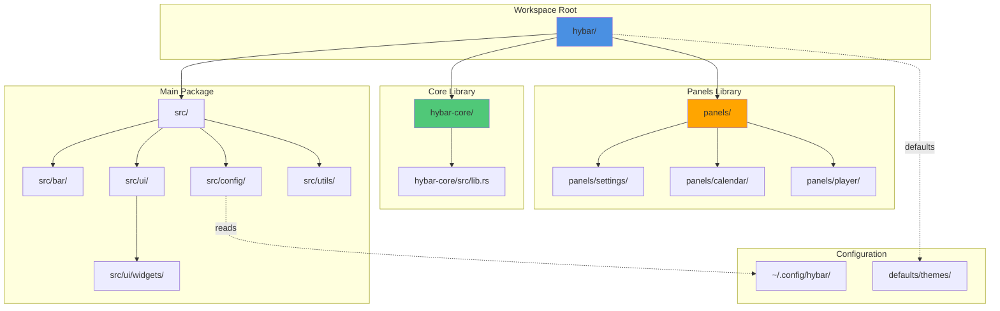
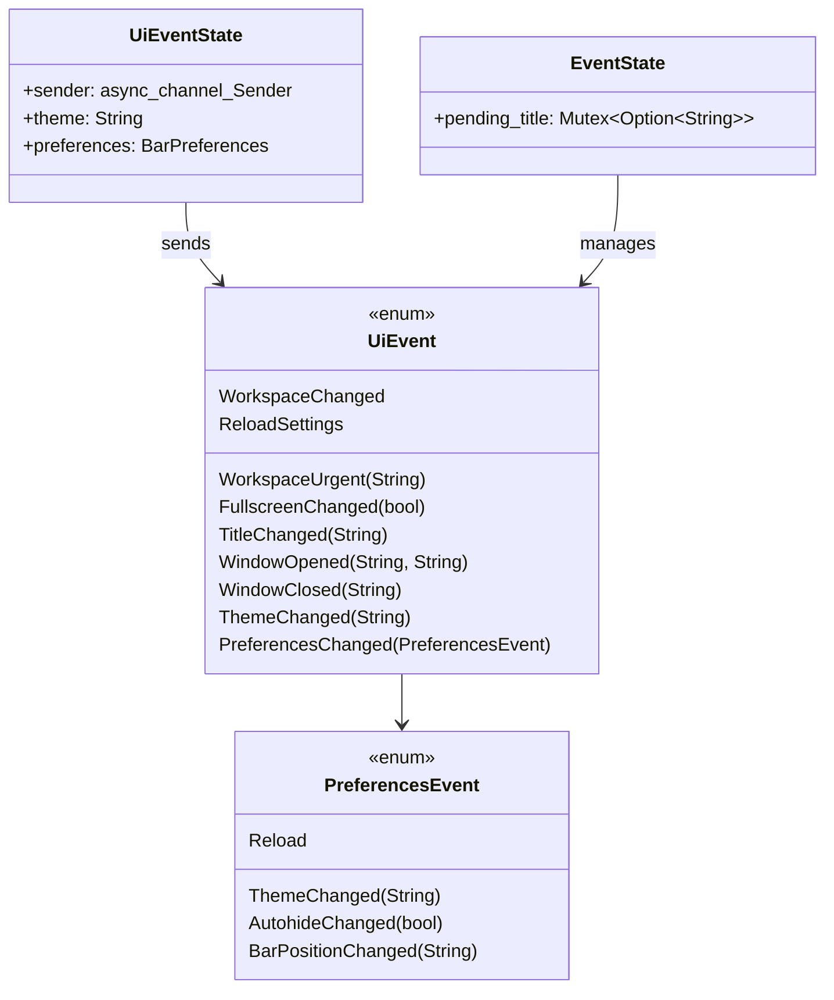

# Arquitectura de HyBar

## Diagrama de Componentes

```mermaid
graph TB
    subgraph "HyBar Application"
        Main[main.rs<br/>Entry Point]
        
        subgraph "Core Modules"
            Bar[bar/<br/>Bar Logic & Events]
            Client[client.rs<br/>Hyprland IPC]
            Config[config/<br/>JSON Config]
            UI[ui/<br/>UI Components]
        end
        
        subgraph "UI Widgets"
            Clock[Clock Widget]
            Workspace[Workspaces Widget]
            Apps[Apps Widget]
            Title[Title Widget]
            Separator[Separator Widget]
        end
        
        subgraph "Support"
            Utils[utils/<br/>CSS, Search, Launch]
            Models[models/<br/>Data Models]
            User[user/<br/>User Management]
        end
    end
    
    subgraph "hybar-core Library"
        WidgetTrait[Widget Trait]
        HasPendingTrait[HasPending Trait]
    end
    
    subgraph "panels Library"
        Settings[Settings Panel]
        Calendar[Calendar Panel]
        Player[Player Panel<br/>MPRIS]
    end
    
    subgraph "External Dependencies"
        GTK4[GTK4<br/>UI Framework]
        LayerShell[gtk4-layer-shell<br/>Wayland Integration]
        Hyprland[Hyprland Compositor<br/>Socket IPC]
        Tokio[Tokio<br/>Async Runtime]
    end
    
    subgraph "User Config"
        ConfigFile[~/.config/hybar/<br/>config.json]
        Themes[~/.config/hybar/themes/<br/>*.css]
    end
    
    Main --> Bar
    Main --> Client
    Main --> Config
    Main --> UI
    
    Bar --> Utils
    Bar --> Models
    
    UI --> Clock
    UI --> Workspace
    UI --> Apps
    UI --> Title
    UI --> Separator
    
    Clock -.implements.-> WidgetTrait
    Workspace -.implements.-> WidgetTrait
    Apps -.implements.-> WidgetTrait
    Title -.implements.-> WidgetTrait
    
    Settings -.uses.-> WidgetTrait
    Calendar -.uses.-> WidgetTrait
    Player -.uses.-> WidgetTrait
    
    Main --> Settings
    Main --> Calendar
    Main --> Player
    
    Client --> Hyprland
    Main --> GTK4
    GTK4 --> LayerShell
    LayerShell --> Hyprland
    Bar --> Tokio
    Client --> Tokio
    
    Config --> ConfigFile
    Utils --> Themes
    
    style Main fill:#4a90e2
    style WidgetTrait fill:#50c878
    style HasPendingTrait fill:#50c878
    style GTK4 fill:#ff6b6b
    style Hyprland fill:#ff6b6b
```

## Diagrama de Flujo de Eventos

```mermaid
sequenceDiagram
    participant H as Hyprland
    participant C as Client (IPC)
    participant B as Bar/Events
    participant UI as UI Widgets
    participant G as GTK4
    
    H->>C: Workspace Changed
    C->>B: UiEvent::WorkspaceChanged
    B->>UI: Update Workspace Widget
    UI->>G: Render Update
    
    H->>C: Window Opened/Closed
    C->>B: UiEvent::WindowOpened/Closed
    B->>UI: Update Apps Widget
    UI->>G: Render Update
    
    H->>C: Fullscreen Changed
    C->>B: UiEvent::FullscreenChanged
    B->>B: Toggle AutoHide
    B->>G: Show/Hide Bar
    
    Note over C,B: async-channel for<br/>event communication
    
    UI->>B: User Click (Settings)
    B->>UI: Open Settings Panel
    UI->>G: Show Panel Window
```

## Diagrama de Arquitectura de Capas

```mermaid
graph LR
    subgraph "Presentation Layer"
        A[GTK4 Widgets<br/>UI Components]
        B[CSS Themes<br/>Styling]
    end
    
    subgraph "Application Layer"
        C[Bar Manager<br/>Event Loop]
        D[Widget System<br/>Clock, Apps, etc]
        E[Panel System<br/>Settings, Calendar]
    end
    
    subgraph "Business Logic"
        F[Hyprland Client<br/>IPC Protocol]
        G[Config Manager<br/>JSON Parser]
        H[Event System<br/>async-channel]
    end
    
    subgraph "Core Abstractions"
        I[Widget Trait<br/>Interface]
        J[HasPending Trait<br/>State]
    end
    
    subgraph "Infrastructure"
        K[Tokio Runtime<br/>Async Executor]
        L[gtk4-layer-shell<br/>Wayland Layer]
    end
    
    A --> C
    B --> A
    D --> C
    E --> C
    C --> F
    C --> G
    C --> H
    D -.implements.-> I
    E -.implements.-> I
    F --> K
    H --> K
    A --> L
    
    style I fill:#50c878
    style J fill:#50c878
```

## Estructura de Módulos

```mermaid
graph TD
    subgraph "Workspace Root"
        ROOT[hybar/]
    end
    
    subgraph "Main Package"
        SRC[src/]
        BAR[src/bar/]
        UI[src/ui/]
        WIDGETS[src/ui/widgets/]
        CONFIG[src/config/]
        UTILS[src/utils/]
    end
    
    subgraph "Core Library"
        CORE[hybar-core/]
        CORESRC[hybar-core/src/lib.rs]
    end
    
    subgraph "Panels Library"
        PANELS[panels/]
        SETTINGS[panels/settings/]
        CALENDAR[panels/calendar/]
        PLAYER[panels/player/]
    end
    
    subgraph "Configuration"
        DEFAULTS[defaults/themes/]
        USERCONF[~/.config/hybar/]
    end
    
    ROOT --> SRC
    ROOT --> CORE
    ROOT --> PANELS
    
    SRC --> BAR
    SRC --> UI
    SRC --> CONFIG
    SRC --> UTILS
    UI --> WIDGETS
    
    CORE --> CORESRC
    
    PANELS --> SETTINGS
    PANELS --> CALENDAR
    PANELS --> PLAYER
    
    ROOT -.defaults.-> DEFAULTS
    CONFIG -.reads.-> USERCONF
    
    style ROOT fill:#4a90e2
    style CORE fill:#50c878
    style PANELS fill:#ffa500
```

## Tipos de Eventos

```mermaid
classDiagram
    class UiEvent {
        <<enum>>
        WorkspaceChanged
        WorkspaceUrgent(String)
        FullscreenChanged(bool)
        TitleChanged(String)
        ReloadSettings
        WindowOpened(String, String)
        WindowClosed(String)
        ThemeChanged(String)
        PreferencesChanged(PreferencesEvent)
    }
    
    class PreferencesEvent {
        <<enum>>
        Reload
        ThemeChanged(String)
        AutohideChanged(bool)
        BarPositionChanged(String)
    }
    
    class UiEventState {
        +sender: async_channel_Sender
        +theme: String
        +preferences: BarPreferences
    }
    
    class EventState {
        +pending_title: Mutex~Option~String~~
    }
    
    UiEvent --> PreferencesEvent
    UiEventState --> UiEvent : sends
    EventState --> UiEvent : manages
```
